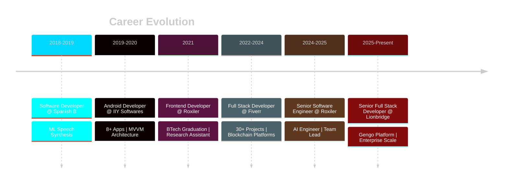

<div align="center">

<!-- Animated SVG Banner -->


<!-- Animated Intro -->
<a href="https://git.io/typing-svg">
  
</a>

<br/>

<!-- Quick Stats Pills -->
<p>
  
  
  
  
</p>

<!-- Social Links with Glow Effect -->
<p>
  <a href="https://www.linkedin.com/in/shashank-shahare/">
    
  </a>
  <a href="https://shashank22.com">
    
  </a>
  <a href="mailto:srshahare22@gmail.com">
    
  </a>
  <a href="https://srshahare22.medium.com/">
    
  </a>
</p>

<br/>

<!-- Profile Views Counter -->


</div>

<br/>

<!-- Animated Divider -->


<br/>

##  &nbsp;Executive Summary

<div align="center">
<table>
<tr>
<td>

```typescript
class SeniorSoftwareEngineer {
  name = "Shashank Shahare";
  title = "Senior Software Engineer | AI Engineer";
  location = "Pune, India 🇮🇳";
  
  expertise = {
    core: ["Full Stack Development", "AI/LLM Integration", "System Architecture"],
    specialization: ["Agentic AI", "Microservices", "Blockchain"],
    leadership: ["Team Management", "Code Reviews", "Technical Mentorship"]
  };
  
  impact = {
    projectsDelivered: "30+",
    languagesSupported: "40+",  // Gengo Platform
    performanceGain: "30%",     // Error rate reduction
    dataIntegrity: "100%"       // Migration accuracy
  };
  
  philosophy = () => "Build systems that scale, lead teams that excel, ship products that matter.";
}
```

</td>
</tr>
</table>
</div>

<br/>

> *"Qualified Solution Architect with extensive experience in designing and implementing comprehensive web solutions. Proven track record in leading development teams, fostering cross-functional collaboration, and delivering innovative AI-powered solutions aligned with business objectives."*

<br/>


<br/>

##  &nbsp;Technical Arsenal

<div align="center">

### 🎨 Frontend Excellence
<p>
  
</p>
<p>
  
  
  
  
  
  
  
</p>

<br/>

### ⚙️ Backend Mastery
<p>
  
</p>
<p>
  
  
  
  
  
  
  
</p>

<br/>

### 🗄️ Data & Databases
<p>
  
</p>
<p>
  
  
  
  
  
</p>

<br/>

### ☁️ Cloud & Infrastructure
<p>
  
</p>
<p>
  
  
  
  
  
  
</p>

<br/>

### 🤖 AI/ML & Emerging Tech
<p>
  
</p>
<p>
  
  
  
  
  
  
</p>

<br/>

### 🛠️ DevOps & Tools
<p>
  
</p>
<p>
  
  
  
  
  
  
</p>

</div>

<br/>


<br/>

##  &nbsp;Professional Journey

<div align="center">



</div>

<br/>

### 🏢 Experience Timeline

<details open>
<summary><b>🔷 Senior Full Stack Developer @ Lionbridge (via Roxiler) &nbsp;|&nbsp; June 2025 - Present</b></summary>
<br/>
<blockquote>
<p><b>🎯 Enterprise-Scale Translation Platform Engineering</b></p>

<table>
<tr><td>

**Gengo Translation Platform** - Serving 40+ Languages Globally

- 🔧 Built and scaled **event-driven microservices** in Python/PHP with Angular frontends
- ⚡ Optimized APIs via **async patterns, caching, and query tuning**
- 📈 Improved **p95 latency** and reduced error rates by **30%**
- 🔄 Refactored legacy codebases for long-term **scalability and maintainability**
- ✅ Conducted comprehensive **code reviews** enforcing quality standards

</td></tr>
</table>

<p>
  
  
  
  
  
</p>
</blockquote>
</details>

<details open>
<summary><b>🔷 Senior Software Engineer | AI Engineer @ Roxiler Systems &nbsp;|&nbsp; Mar 2024 - Jun 2025</b></summary>
<br/>
<blockquote>
<p><b>🎯 AI-Powered Platform Development & Team Leadership</b></p>

<table>
<tr><td>

**MyCareerBuddy** - AI-Driven Career Development Platform

- 🤖 Designed end-to-end platform leveraging **Agentic AI, LLMs, and RAG systems**
- 📊 Built **personalized recommendation engine** with progress tracking
- 💳 Architected **secure payment solutions** and analytics pipelines
- 🔄 Orchestrated **Tableau infrastructure migration** with 100% data integrity
- 👥 Led and mentored engineering team with **code reviews and best practices**

</td></tr>
</table>

<p>
  
  
  
  
  
</p>
</blockquote>
</details>

<details>
<summary><b>🔷 Full Stack Developer @ Fiverr (Freelance) &nbsp;|&nbsp; Oct 2022 - Nov 2024</b></summary>
<br/>
<blockquote>
<p><b>🎯 Global Client Delivery & Blockchain Expertise</b></p>

<table>
<tr><td>

**30+ Projects Delivered Globally**

- 🌐 Delivered **scalable Django/React solutions** with WebSocket support
- ⛓️ Built **cryptocurrency exchange** and **NFT marketplace** platforms
- 🔐 Integrated **wallet connectors, smart contracts**, and multi-chain support
- 🚀 Partnered with startups to define MVPs and ship **production-ready products**

</td></tr>
</table>

<p>
  
  
  
  
  
</p>
</blockquote>
</details>

<details>
<summary><b>🔷 Frontend Developer @ Roxiler Systems &nbsp;|&nbsp; Mar 2021 - Aug 2021</b></summary>
<br/>
<blockquote>

- 🎨 Delivered responsive UI features from Figma/UX designs
- 📱 Ensured cross-platform performance and accessibility
- 🔧 Maintained code quality with Git versioning

</blockquote>
</details>

<details>
<summary><b>🔷 Android Developer @ IIY Softwares &nbsp;|&nbsp; Mar 2019 - Dec 2020</b></summary>
<br/>
<blockquote>

- 📱 Built **8+ Android applications** using MVVM & Material Design
- 🔗 Integrated REST APIs, cloud services, and local storage
- 🏆 Project Lead role with end-to-end delivery ownership

</blockquote>
</details>

<details>
<summary><b>🔷 Software Developer @ Spanish B &nbsp;|&nbsp; Dec 2018 - Feb 2019</b></summary>
<br/>
<blockquote>

- 🎤 Built **ML-based speech synthesis module** for accessibility
- 📱 Contributed to mobile app front-end architecture

</blockquote>
</details>

<br/>


<br/>

##  &nbsp;Featured Projects

<div align="center">

<!-- Project 1: Gengo -->
<table>
<tr>
<td width="100%">
<h3 align="center">🌐 Gengo Translation Platform</h3>
<p align="center">
  
</p>
<p align="center">
  <b>Large-Scale Microservices Translation Engine | 40+ Languages</b>
</p>

| Impact | Technology |
|:------:|:----------:|
| 🚀 **30%** Error Rate Reduction | Python • PHP • Angular |
| ⚡ **p95** Latency Optimized | Event-Driven Architecture |
| 🌍 **40+** Languages Supported | Async Patterns • Caching |
| 📈 Real-time Translation Workflows | Microservices |

<p align="center">
  
  
  
  
  
</p>
</td>
</tr>
</table>

<br/>

<!-- Project 2: MyCareerBuddy -->
<table>
<tr>
<td width="100%">
<h3 align="center">🤖 MyCareerBuddy - AI Career Portal</h3>
<p align="center">
  
</p>
<p align="center">
  <b>LLM/RAG-Powered Career Development Platform</b>
</p>

| Feature | Technology |
|:-------:|:----------:|
| 🧠 **Agentic AI** Recommendations | LLM Integration |
| 📊 Personalized Learning Paths | RAG Systems |
| 💳 Secure Payment Integration | Analytics Pipeline |
| 📈 Real-time Progress Tracking | Time-Series Data |

<p align="center">
  
  
  
  
  
</p>
</td>
</tr>
</table>

<br/>

<!-- Project 3: Tableau Migration -->
<table>
<tr>
<td width="100%">
<h3 align="center">🔄 Tableau Infrastructure Migration Tool</h3>
<p align="center">
  
</p>
<p align="center">
  <b>Zero-Downtime Enterprise Infrastructure Migration Framework</b>
</p>

| Achievement | Technology |
|:-----------:|:----------:|
| ✅ **100%** Data Integrity | Checksum Validation |
| 🔄 Automated Rollback | Failover Mechanisms |
| ⏱️ Minimal Downtime | Enterprise Migration |
| 🛡️ Risk Mitigation | System Reliability |

<p align="center">
  
  
  
  
</p>
</td>
</tr>
</table>

<br/>

<!-- Project 4: Blockchain -->
<table>
<tr>
<td width="100%">
<h3 align="center">⛓️ Blockchain Platforms Suite</h3>
<p align="center">
  
</p>
<p align="center">
  <b>Cryptocurrency Exchange & NFT Marketplace</b>
</p>

| Platform | Features |
|:--------:|:--------:|
| 💱 Crypto Exchange | Secure Wallet Connectors |
| 🎨 NFT Marketplace | Multi-chain Token Support |
| 🔐 Smart Contracts | Trustless Transactions |
| 💰 Liquidity Features | On-chain Asset Management |

<p align="center">
  
  
  
  
  
</p>
</td>
</tr>
</table>

</div>

<br/>


<br/>

##  &nbsp;Impact Metrics

<div align="center">

<table>
<tr>
<td align="center" width="25%">

<br/><b>Projects Delivered</b>
<br/><sub>Global Clients</sub>
</td>
<td align="center" width="25%">

<br/><b>Languages Supported</b>
<br/><sub>Gengo Platform</sub>
</td>
<td align="center" width="25%">

<br/><b>Error Reduction</b>
<br/><sub>Performance Optimization</sub>
</td>
<td align="center" width="25%">

<br/><b>Data Integrity</b>
<br/><sub>Migration Accuracy</sub>
</td>
</tr>
</table>

</div>

<br/>


<br/>

## 🎓 Education & Research

<div align="center">

<table>
<tr>
<td width="50%" align="center">

### 📚 Education

<br/>


**Dr. Babasaheb Ambedkar Technological University**  
*Raigad, Maharashtra, India*  
📅 2017 - 2021

<br/>


<br/><br/>


*Completed 2020*

</td>
<td width="50%" align="center">

### 📖 Research & Publications

<br/>


<br/><br/>

**Published in Recognized Journals:**

🔬 **Blockchain Technology**  
*Distributed Systems & Security*

🤖 **Artificial Intelligence**  
*Machine Learning Applications*

<br/>


*AI & Blockchain Research*

</td>
</tr>
</table>

</div>

<br/>


<br/>

## 📊 GitHub Analytics

<div align="center">

<!-- Activity Graph -->


<br/><br/>

<!-- Stats Cards -->
<p>
  
  
</p>

<br/>

<!-- Top Languages -->


<br/><br/>

<!-- Trophies -->


</div>

<br/>


<br/>

## 🐍 Contribution Snake

<div align="center">
  <picture>
    <source media="(prefers-color-scheme: dark)" srcset="https://raw.githubusercontent.com/srshahare/srshahare/output/github-contribution-grid-snake-dark.svg">
    <source media="(prefers-color-scheme: light)" srcset="https://raw.githubusercontent.com/srshahare/srshahare/output/github-contribution-grid-snake.svg">
    
  </picture>
</div>

<br/>


<br/>

## 💡 What I Bring to the Table

<div align="center">

<table>
<tr>
<td align="center" width="33%">

<br/><br/>
<b>Architecture</b>
<br/>
<sub>Scalable microservices, event-driven systems, and cloud-native solutions</sub>
</td>
<td align="center" width="33%">

<br/><br/>
<b>AI Integration</b>
<br/>
<sub>LLM-powered platforms, RAG systems, and intelligent automation</sub>
</td>
<td align="center" width="33%">

<br/><br/>
<b>Leadership</b>
<br/>
<sub>Team mentorship, code reviews, and cross-functional collaboration</sub>
</td>
</tr>
</table>

</div>

<br/>


<br/>

## 🤝 Let's Build Something Great Together

<div align="center">

<p>
  <b>Open for collaborations, consulting, and exciting opportunities!</b>
</p>

<br/>

<a href="https://www.linkedin.com/in/shashank-shahare/">
  
</a>
&nbsp;
<a href="mailto:srshahare22@gmail.com">
  
</a>
&nbsp;
<a href="https://shashank22.com">
  
</a>

<br/><br/>


<br/><br/>

<!-- Quote -->


<br/><br/>


</div>

<br/>

<!-- Footer Wave -->

